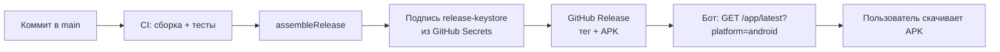

# Архитектура: Android VPN-клиент (Kotlin, Jetpack Compose, test-first)

Дата: 2026-10-03
Статус: на ревью
Область: Android-клиент целиком. Бэкенд — вне области, контракт общий с iOS (`2026-10-02-api-contract.md`).
Базовые документы: `docs/superpowers/specs/2026-09-30-vpn-app-design.md`, `docs/design/mockup.html`
Родственный документ: `2026-10-02-vpn-app-architecture.md` (iOS-клиент)

## 0. Решения, принятые до проектирования

| Вопрос | Решение | Почему |
|---|---|---|
| VPN-движок | **OpenVPN 3** (официальный, MPL 2.0), свой JNI-мост | Лицензия не заражает приложение; активно сопровождается; прецедент — OpenVPN Connect на Android. Готовой библиотеки НЕТ, мост пишем сами — см. §4.7. **Киллсвитча ОС не даёт** — см. §4.8 |
| Лицензия всего приложения | **GPLv2** | Следствие выбора движка. Наш репозиторий уже публичный, iOS-стек — TunnelKit под GPLv3 с исключением. Обязательство открыть исходники не стоит ничего |
| UI | Jetpack Compose | Нативный эквивалент SwiftUI; макет `mockup.html` воспроизводится токенами |
| minSdk | **26 (Android 8.0)** | Покрытие ~98%; Compose и VpnService работают |
| HTTP | OkHttp + kotlinx.serialization | Стандарт; совпадает с транспортом под Retrofit |
| Хранение сессии | EncryptedSharedPreferences (androidx.security.crypto) | Обёртка над Keystore, minSdk 23 |
| Разделение с iOS | Полное, общего рантайм-кода нет | Домен и модели пишутся дважды; общий — только документ контракта |
| Канал доставки | **APK, раздача через Telegram-бот** | Google Play закрыт (см. §11), RuStore блокирует VPN-обходчики |

## 1. Принципы

1. **Тестируемость через границы, а не через моки фреймворков.** Каждая системная зависимость (Keystore, VpnService, сеть, файлы) скрыта за интерфейсом в `core:domain`. Тест подставляет fake — устройство не нужно.
2. **Граф зависимостей направлен вниз.** `core:domain` не зависит ни от чего, кроме stdlib и корутин.
3. **Логика туннеля — в foreground-сервисе, не в UI.** Активность может быть уничтожена системой в любой момент.
4. **Никаких обещаний защиты без замера.** Зелёный статус выводится только из подтверждения трафика через туннель, не из `VpnService`-состояния и не из системного флага. Инвариант, не деталь UI (§6).
5. **Атомарность записи конфига.** Битый `.ovpn` ломает подключение до ручного вмешательства.

## 2.  Целевая конфигурация

| Параметр | Значение |
|---|---|
| Язык | Kotlin 2.x, coroutines + Flow |
| UI | Jetpack Compose, Material 3 (тема — своя, из токенов) |
| Минимальная версия | API 26 (Android 8.0) |
| targetSdk | 35 (Android 15) |
| Сборка | Gradle (Kotlin DSL), version catalog |
| VPN-движок | OpenVPN 3, нативный `libopenvpn.so` + свой JNI-мост |
| Точка входа туннеля | `VpnService` + foreground-сервис |
| Разрешение | `VpnService.prepare()` — системный диалог, один раз |
| Хранилище секретов | EncryptedSharedPreferences + Keystore |
| Хранилище профиля | Личная папка приложения + согласованная запись |
| Тесты | JUnit5 + Robolectric (JVM), Compose UI Test |

## 3. Граф модулей

```
┌─────────────────────────────────────────┐
│  :app  (composition root, DI)           │
└──────────────┬──────────────────────────┘
               │
     ┌─────────┼─────────┬──────────────┐
     ▼         ▼         ▼              ▼
┌─────────┐┌─────────┐┌──────────┐┌────────────┐
│:feature ││:feature ││:feature  ││:feature    │
│ :auth   ││ :home   ││:configs  ││ :account   │
└────┬────┘└────┬────┘└────┬─────┘└─────┬──────┘
     └──────────┴──────────┴────────────┘
                │
        ┌───────┴────────┐
        ▼                ▼
  ┌───────────┐   ┌──────────────┐
  │ :core:ui  │   │ :core:domain │ ← 0 зависимостей
  │ токены    │   │ модели + API │
  └───────────┘   └──────┬───────┘
                         │
   ┌────────┬────────┬───┴─────┬────────────┐
   ▼        ▼        ▼         ▼            ▼
┌────────┐┌────────┐┌────────┐┌──────────┐┌──────────┐
│:core   ││:core   ││:core   ││:core     ││:core     │
│:network││:config ││:security││:tunnel  ││:protection│
│ API    ││ .ovpn  ││ Keystore││VpnService││ проба    │
└────────┘└────────┘└────────┘└────┬─────┘└──────────┘
                                   │
                    ┌──────────────┴───────────────┐
                    ▼                              ▼
            ┌──────────────┐              ┌─────────────────┐
            │ :vpnservice  │              │ ядро + JNI-мост │
            │ VpnService + │─── JNI ─────▶│ libopenvpn.so    │
            │ foreground   │              │ (GPLv2)          │
            └──────────────┘              └─────────────────┘

:test-support (fakes + фикстуры) ── только тест-таргеты
```

**Правило:** стрелка = «зависит от». Ни один модуль не зависит от того, что выше него. `core:domain` зависит только от stdlib и `kotlinx-coroutines-core` — поэтому весь домен тестируется на JVM без Android-устройства, эмулятора и Robolectric.

## 4. Модули и их ответственность

### 4.1 `core:domain` (без зависимостей)

**Что:** модели предметной области и интерфейсы границ. Ни байта ввода-вывода.
**Как:** зависит от него всё.
**Модели:** `AuthLink`, `AuthOperation`, `Session`, `Connection`, `ConnectionStatus`, `Profile`, `ProtectionVerdict`.
**Интерфейсы:** §5.

`ConnectionStatus` — **наша** модель, а не `VpnService`-состояние и не строка статуса из ics-openvpn. Системное состояние отображается в неё явным маппингом в адаптере и в домен не протекает.

### 4.2 `core:network`

**Что:** клиент API по контракту `2026-10-02-api-contract.md`. Собирает запросы OkHttp, разбирает ответы kotlinx.serialization, маппит ошибки в типизированные.
**Как:** реализует `AuthService` и `ConfigService`.
**Зависит:** `core:domain`.
**Тестируется:** без сети — через `MockWebServer`; фикстуры JSON из `:test-support`. Платформенное поле запроса — `"android"` (§1 контракта).

### 4.3 `core:config`

**Что:** хранение `.ovpn` по протоколу согласованной записи (§7).
**Как:** реализует `ProfileStore`.
**Зависит:** `core:domain` (только `File`-абстракция, без Android-типов).
**Тестируется:** на временной директории — temp+rename, откат, обрыв на середине записи. **Полностью на JVM**, без Robolectric.

### 4.4 `core:security`

**Что:** хранение сессии в EncryptedSharedPreferences, генерация секрета операции входа, очистка при выходе.
**Как:** реализует `SessionStore`.
**Зависит:** `core:domain`.
**Тестируется:** с fake-обёрткой над хранилищем (интерфейс `SecureBackend`) — как на iOS с `KeychainBackend`.

### 4.5 `core:tunnel` — обёртка над VpnService

**Что:** app-side управление туннелем: `VpnService.prepare()`, запуск/остановка foreground-сервиса, наблюдение состояния, оформление `Intent` для `:vpnservice`.
**Как:** реализует `TunnelControlling`.
**Зависит:** `core:domain`.
**Тестируется:** с fake-адаптером; реальный VpnService — инструментальным тестом на эмуляторе.

**Разделение как на iOS:** `core:tunnel` — только app-side (не поднимает туннель сам), `:vpnservice` — процесс, где живёт `VpnService` и наш JNI-мост к ядру OpenVPN 3. Парсинг `.ovpn` делает ядро (§4.7).

Маппинг «состояние VpnService → `ConnectionStatus`» живёт в `core:tunnel` и **никогда не возвращает `.protected`** (§6).

### 4.6 `core:protection` — проба защиты

**Что:** реализация `ProtectionProbe` на Android-примитивах.
**Зависит:** `core:domain`.
**Что читает:** таблицу маршрутов активного `Network` через `ConnectivityManager.getLinkProperties()` — признак 1; наличие IPv6-маршрута по умолчанию вне туннеля — признак 2; конфигурацию DNS активного линка — признак 3.
**Не делает:** не ходит на внешний сервис за реальным IP.

**Честная оговорка.** `core:protection` **компилируется только под Android** (нужны `ConnectivityManager`, `LinkProperties`). Логика вычисления вердикта — в `core:domain` и тестируется на JVM; сбор фактов — здесь и проверяется инструментально. Это то же разделение, что на iOS между `ProtectionGate` и провайдером пробы.

### 4.7 Ядро VPN: решение (проверено 2026-10-04)

**Исходная идея — «ics-openvpn подключить submodule в `:vpnservice`» — не работает,
и это проверено по фактам, а не предположено.**

1. **Это приложение, а не библиотека.** `main/build.gradle.kts` объявляет
   `alias(libs.plugins.android.application)`. В `settings.gradle.kts` upstream
   ровно три модуля: `:main` (приложение), `:tlsexternalcertprovider`,
   `:remoteExample`. Библиотечного модуля нет. В README прямо: *«goal of this
   project is about providing an open-source OpenVPN app for Android. It is NOT
   about creating library to be used in other projects»*.
2. **JitPack не спасает.** `com.github.schwabe:ics-openvpn` публикует
   `<packaging>apk</packaging>` — то есть APK. Как зависимость неприменим.
   Плюс из всех тегов собираются единицы: `v0.6.73-production` — «ok»,
   `v0.7.5`, `v0.7.13`, `v0.7.15-production` — «Error». Версия застряла на 0.6.x.
3. **Форки не решают проблему.** Просмотрены 15 самых звёздных форков: **ни один
   не выделил библиотечный модуль**. Все 50–56 МБ, то есть полные приложения.
   За десять лет задача никому не понадобилась — рассчитывать на готовый форк
   нельзя.
4. **`co.pango:openvpn-aar` — не то, чем кажется.** Это 17 МБ AAR на Maven
   Central с лицензией «Apache 2.0», 163 версии, релизы идут по 2026 год.
   Но при вскрытии:
   - `classes.jar` — **22 байта**, пустой: Java/Kotlin API нет вообще,
     только `jni/*/libopenvpn.so` и `assets/pie_openvpn.*`;
   - **ни `LICENSE`, ни `NOTICE` внутри AAR нет**;
   - внутри `libopenvpn.so` — ядро **OpenVPN 2.8** (по строкам сообщений:
     «OpenVPN 2.8 will remove…», «removed in OpenVPN 2.7»);
   - обёртка — `co.pango:sdk-openvpn`, тянущий десятки партнёрских модулей
     (`sdk-partner-api`, `sdk-switcher`, `sdk-deps-locator`, `soloader`, gson).
   Проект-источник — `AnchorFreePartner/hydrasdk-demo-android`, и он
   **заброшен с 2024**, а юрисдикция компании (AnchorFree) — США.
   Ядро OpenVPN 2.x под GPLv2, а вывеска — Apache 2.0. Либо лицензия заявлена
   неверно, либо ядро переписано. Проверить нельзя, а цена ошибки — лицензионный
   и санкционный риск. **Не берём.**

**Итог: готового пути нет.** Библиотеку, пригодную к встраиванию, придётся
делать самим. Остаются три варианта, и у каждого цена известна:

| Путь | Суть | Цена | Риск |
|---|---|---|---|
| **A. Форк-обёртка ics-openvpn, обрезанный до библиотеки** | Взять upstream, вырезать `res/`, Activity, `aidl/`, оставшийся эксплойт управления переписать на Kotlin-API, собрать как `com.android.library` | NDK + CMake в CI; GPLv2 на всё приложение; ручная правка при каждом обновлении upstream | Средний: форк расходится с upstream, но ядро и JNI уже работают |
| **B. OpenVPN 3 + свой SWIG/JNI-мост** | Ядро 3-й ветки: лицензия **MPL 2.0** (или AGPLv3 на выбор), есть `javacli/android`, `client/ovpncli.i` для SWIG — так собран OpenVPN Connect под Android | NDK + CMake + SWIG в CI; Java-биндинг писать самим; **OpenVPN 3 не поддерживает TAP и часть опций 2.x** | Средний: MPL снимает GPL-обязательство, но проверить совместимость с нашим `.ovpn` (в нём `redirect-gateway`, `data-ciphers`, `remote-random`, `persist-tun`, `key-direction` — всё это 3-я ветка поддерживает) |
| **C. Сменить протокол на WireGuard** | WireGuard официально публикует Android-библиотеку `com.wireguard.android:tunnel`, Apache-подобная лицензия, готовая интеграция `VpnService` | Переделка серверной стороны, выдача новых конфигов, клиенты iOS тоже; пользовательские `.ovpn` с бэкенда больше не годятся | Высокий: меняет продукт, а не только клиент |

**Рекомендация: путь B.** Причины по убыванию веса:

1. **Лицензия.** MPL 2.0 на ядро вместо GPLv2 снимает обязательство открывать
   исходники всего приложения. Репозиторий и так публичный, но GPLv2 запрещает
   закрытые сборки в будущем (например, если появится отдельный клиент под
   RuStore, где исходники публиковать нельзя).
2. **Actively maintained.** OpenVPN 3 — официальный проект OpenVPN Inc., а не
   хобби одного человека («spare time project» из README ics-openvpn).
   Это важно для безопасности: протокол обновляется, уязвимости правятся.
3. **Готовый прецедент.** OpenVPN Connect на Android собран именно так:
   `javacli/android` + SWIG-обёртка. То есть путь проходим, а не гипотеза.
4. **NDK в CI всё равно нужен.** И путь A, и путь B требуют NDK + CMake.
   Разница только в SWIG — то есть в одном дополнительном шаге сборки.

**Что препятствует немедленному выбору (и почему решение всё же записано):**

- **SWIG в CI** — ещё одна зависимость сборки у проекта, который целиком
  строится на GitHub Actions. Нужно проверить, что SWIG ставится на
  `ubuntu-latest` без боли (пакет в apt есть) и что генерация биндинга
  воспроизводима.
- **Проверка совместимости профиля.** Наш боевой `.ovpn` (см. память о формате)
  содержит `remote 212.22.74.225 443 udp`, `data-ciphers`, `remote-random`,
  `persist-tun`, `key-direction 1`, `redirect-gateway bypass-dhcp`. OpenVPN 3
  поддерживает routed TUN (что нам и нужно), но **полного покрытия опций 2.x
  нет**. Проверить надо до того, как писать мост: если профиль не парсится —
  весь путь B отпадает.
- **Размер.** Ядро + OpenSSL в .so — это ~15–20 МБ на архитектуру. Для APK,
  раздаваемого через Telegram, приемлемо, но стоит помнить.

**ГОТОВЫЙ РЕЦЕПТ СБОРКИ — найден 2026-10-04 (главное снижение риска пути B).**

ics-openvpn **уже решил ровно эту задачу**: собирает JNI-мост к ядру OpenVPN 3
под Android. Его `main/src/main/cpp/CMakeLists.txt` — рабочий проверенный рецепт,
и его можно взять как основу вместо изобретения своего. Что там в действительности:

1. **JNI-мост генерируется SWIG'ом из `ovpncli.i`:**
   ```
   FIND_PACKAGE(SWIG 3.0 REQUIRED)
   ${SWIG_EXECUTABLE} -outdir <out> -c++ -java -package net.openvpn.ovpn3 \
       -outcurrentdir -DOPENVPN_PLATFORM_ANDROID \
       -Iopenvpn3/client -Iopenvpn3 openvpn3/client/ovpncli.i
   ```
   То есть `-DOPENVPN_PLATFORM_ANDROID` включает Android-режим ядра, а Java-классы
   ложатся в пакет `net.openvpn.ovpn3`. **Это не гипотеза — это работающий код.**

2. **Наши `openvpn3` и `openvpn` — ФОРКИ, а не upstream.** В `.gitmodules`
   источники указаны как `../../schwabe/openvpn3.git` и `../../schwabe/openvpn.git`
   — то есть у автора свои копии. При использовании рецепта нужно смотреть, какие
   именно патчи он наложил: возможно, они и есть недостающая часть Android-сборки,
   которой нет в официальном `OpenVPN/openvpn3` (у которого, как проверено выше,
   **нет ни android-триплета vcpkg, ни Android-CI, ни упоминания Android в README**).

3. **Зависимости — 7 публичных репозиториев через git submodule, без vcpkg:**
   `schwabe/openvpn`, `schwabe/platform_external_openssl`, `ARMmbed/mbedtls`,
   `schwabe/openvpn3`, `chriskohlhoff/asio`, `lz4/lz4`, `fmtlib/fmt`.
   Это принципиально: **vcpkg не нужен** — его android-триплетов у OpenVPN 3 всё
   равно нет. Зато нужны 7 подмодулей и NDK.

4. **Опции сборки:** `-DOPENVPN3OSSL=ON` (OpenVPN 3 c OpenSSL),
   `SSLLIBTYPE=STATIC`, `CMAKE_CXX_STANDARD 23`, `ENABLE_PROGRAMS=OFF`,
   `ENABLE_TESTING=OFF`.

5. **Что получится на выходе:** `libovpn3.so` (SWIG-биндинг + ядро),
   `libovpnutil.so`, `libosslutil.so`, плюс `libovpnexec.so` и
   `pie_openvpn.<ABI>` — PIE-исполняемые для запуска OpenVPN 2.x из assets.

**Важное следствие для решения.** Путь B («свой JNI-мост») оказался не «писать
мост с нуля», а «собрать ядро 3.x по чужому проверенному рецепту и заменить
верхний Java-слой своим». Это меняет и трудозатраты, и риск — но **не отменяет
проверок ниже**: наш `.ovpn`, наш `:vpnservice` и наш Kotlin-API всё равно
проверяются первыми.

**РЕЗУЛЬТАТ СПАЙКА 2026-10-04 (прогоны 37158482572, 37158842241).** Спайк
(`.github/workflows/openvpn3-spike.yml`) проверял, соберётся ли ядро. Итог по
шагам:

| Шаг | Результат |
|---|---|
| SWIG ставится из apt | ✅ да, `swig -version` работает |
| NDK доступен на `ubuntu-latest` | ✅ да, ставится через `sdkmanager` |
| upstream `OpenVPN/openvpn3` клонируется | ✅ да, `OPENVPN_PLATFORM_ANDROID` есть в коде — Android-поддержка в официальном проекте, форк не нужен |
| CMake принимает Android-тулчейн | ✅ да — конфигурация доходит до поиска зависимостей |
| Зависимости находятся | ❌ **нет** |

**Главное: apt-библиотеки не годятся для кросс-компиляции.** Это не мелочь, а
суть цены пути. Прогон 2 упал на `Could NOT find lz4 (missing: LZ4_LIBRARY
LZ4_INCLUDE_DIR)` **при установленном `liblz4-dev`**: apt даёт библиотеки под
x86_64 хоста, а CMake ищет их под arm64 Android. То же будет с OpenSSL, mbedTLS,
lzo, jsoncpp, fmt — все они нативные.

**Следствие: все нативные зависимости придётся собирать из исходников под
каждую целевую архитектуру** (arm64-v8a, armeabi-v7a, x86_64). Именно это и
делает ics-openvpn своими `openssl/openssl.cmake`, `lzo.cmake`, `lz4.cmake` и
подмодулями — не из любви к сложности, а потому что иначе нельзя.

**Уточнение оценки пути B.** Ранее он выглядел как «собрать ядро по рецепту».
Теперь видно, что это «собрать 6 нативных библиотек под 3 архитектуры + ядро +
SWIG-биндинг». Это по-прежнему решаемая задача с готовым образцом, но:
- сборка OpenSSL под Android — это минуты, а не секунды, на каждую архитектуру;
- кэш зависимостей в CI становится обязательным, иначе прогоны будут длинными;
- ics-openvpn собирает только arm64-v8a, armeabi-v7a, x86, x86_64 — то же
  придётся делать нам, если хотим работать на телефоне и эмуляторе.

**Что это не меняет:** решение остаётся за OpenVPN 3 по лицензии и
сопровождаемости. Альтернатива A (форк ics-openvpn) имеет ту же самую проблему с
нативными зависимостями — просто она уже решена внутри проекта.

**Порядок проверки перед кодом (не пропускать):**
1. `openvpn3` собирается под Android arm64 с NDK на `ubuntu-latest` — прогнать
   сборку в отдельной ветке CI, без интеграции в `:vpnservice`.
2. Наш боевой `.ovpn` парсится `ovpncli` без ошибок.
3. SWIG-биндинг генерируется и линкуется.
4. Только после этого писать Kotlin-обёртку и включать `:vpnservice`.

**Пока это не сделано, `:vpnservice` остаётся заглушкой**, а приложение честно
отказывается подключаться. Это осознанно: заглушка, изображающая успех, дала бы
ложную уверенность в защите, против которой написан весь §6.

**Отдельно про ics-openvpn как источник идей:** он остаётся полезным для чтения —
там настоящий рабочий `VpnService`-слой, killswitch-логика и разбор профилей.
Но брать его код целиком в проект под MPL нельзя: GPLv2 несовместим.

### 4.8 `:vpnservice`

**Что:** `VpnService`-реализация, foreground-сервис, обязательная нотификация, JNI-мост.
**Зависит:** `core:config` (чтение профиля), ядро OpenVPN 3 через собственный JNI-мост (§4.7).
**Ответственность:** поднять интерфейс через `Builder`, передать профиль в ядро, держать foreground, корректно остановиться.

**Требования платформы (Android 14+, обязательно):**

```xml
<uses-permission android:name="android.permission.FOREGROUND_SERVICE" />
<uses-permission android:name="android.permission.FOREGROUND_SERVICE_SPECIAL_USE" />

<service
    android:name=".VpnTunnelService"
    android:permission="android.permission.BIND_VPN_SERVICE"
    android:foregroundServiceType="specialUse"
    android:exported="false">
    <intent-filter>
        <action android:name="android.net.VpnService" />
    </intent-filter>
    <property
        android:name="android.app.PROPERTY_SPECIAL_USE_FGS_SUBTYPE"
        android:value="Поддержание VPN-туннеля и статистика соединения" />
</service>
```

**`dataSync` использовать нельзя** — Android 14 обрывает его через 6 часов, а Android 15 ограничивает перезапуски. Это документированный отказ, не гипотеза.

**Ключи `Builder`:** заблокированные приложения → пусто; `setBlocking(true)`; полный перехват IPv4 (адрес + маршрут по умолчанию); **IPv6 закрывается маршрутом `::/0`, а не отсутствием настройки**; DNS из профиля, не системный.

**`setBlocking(true)` — это НЕ killswitch (исправлено 2026-10-03).** `setBlocking`
блокирует трафик, только пока интерфейс жив. Если foreground-сервис убит — OOM,
свайп из recents, лимиты Android 15 на долгоживущие сервисы — туннель падает
вместе с блокировкой, и весь трафик немедленно уходит **открытым**. Никакой
логики «дожать блокировку» у приложения нет и быть не может: killswitch уровня ОС
на Android даёт только связка **Always-on VPN + «Блокировать соединения без VPN»**,
и включает её **пользователь** в системных настройках, а не приложение.

Отсюда два следствия:
1. Обещать «готовый killswitch от ics-openvpn» нельзя — его нет. У приложения есть
   блокировка на время жизни интерфейса, и это надо честно называть.
2. Приложение должно **подсказать** пользователю включить Always-on VPN для нашего
   профиля (`Settings.ACTION_VPN_SETTINGS`) и объяснить разницу. Молчать об этом —
   значит оставить пользователя в уверенности, что защита переживёт падение сервиса.

Отдельный риск, которого нет в §13: **смерть FGS — вектор утечки**. §13 перечисляет
ошибки маршрутизации, но не падение сервиса. При смерти FGS маршруты снимаются
вместе с интерфейсом, трафик уходит открытым, а UI может ещё показывать зелёное.

### 4.9 `core:ui`

**Что:** токены дизайна, Compose-тема, базовые компоненты. Только представление.
**Зависит:** Compose, ничего из домена.

### 4.10 `feature:*`

`feature:auth`, `feature:home`, `feature:configs`, `feature:account` — по одному на группу экранов макета. Каждый содержит ViewModel и Compose-экраны. ViewModel зависит **только** от интерфейсов `core:domain` — состояния экранов тестируются без UI.

### 4.11 `:app`

Composition root: DI, сборка модулей, стартовая навигация. Логики не содержит.

## 5. Интерфейсы границ (Kotlin)

Ключевой артефакт: интерфейсы объявляются **до** реализаций, чтобы потоки не блокировали друг друга. Версия: `WA0-v1`.

```kotlin
// core:domain — Auth

sealed interface PollOutcome {
    /** Не ошибка: пользователь ещё подтверждает в боте. */
    data class Pending(val retryAfterMillis: Int?) : PollOutcome
    data class Confirmed(val session: Session) : PollOutcome
    data object Expired : PollOutcome
    data object Denied : PollOutcome
    data object AttemptLimitExceeded : PollOutcome
}

interface AuthService {
    suspend fun requestLink(): AuthLink
    /**
     * Предъявляет СЕКРЕТ (сгенерирован приложением) И deviceNonce (ввёл пользователь,
     * прочитав в боте). Без nonce подтверждение не привязано к этому устройству — login-CSRF.
     */
    suspend fun pollSession(operation: AuthOperation, deviceNonce: String): PollOutcome
    suspend fun logout()
}

interface SessionStore {
    fun save(session: Session)
    fun load(): Session?
    fun clear()
}

/** Для тестов: развязывает хранение от EncryptedSharedPreferences. */
interface SecureBackend {
    fun put(key: String, value: ByteArray)
    fun get(key: String): ByteArray?
    fun remove(key: String)
}
```

```kotlin
// core:domain — Config

interface ConfigService {
    suspend fun fetchConnections(): List<Connection>      // /me
    suspend fun fetchProfile(id: Connection.Id): ByteArray // /config/{id}, сырой .ovpn
}

interface ProfileStore {
    fun load(): Profile?
    fun stage(raw: ByteArray): StagedProfile   // во временный файл + валидация
    fun commit(staged: StagedProfile)          // атомарная замена, старая → backup
    fun rollback()                             // вернуть последнюю рабочую
}
```

```kotlin
// core:domain — Tunnel

interface TunnelControlling {
    suspend fun connect(profile: Profile)
    suspend fun disconnect()
    /** Текущее состояние — для поздно подписавшихся и для возврата из фона. */
    val current: ConnectionStatus
    /** Мультиподписчичная лента. Новый подписчик получает current первым событием. */
    fun statusStream(): Flow<ConnectionStatus>
}

// ВАЖНО: TunnelControlling НЕ эмитит .Protected.
// Он эмитит Connecting / VerifyingProtection / Disconnected / Failed.
// Зелёное добавляет ProtectionGate.
```

```kotlin
// core:domain — Protection

fun interface ProtectionProbe {
    suspend fun verify(): ProtectionVerdict
}

/**
 * Доказательство защиты. Конструктор `internal` — собрать можно только внутри core:domain.
 * Внешние модули не могут сконструировать evidence руками.
 */
class ProtectionEvidence internal constructor(
    val ipv4InTunnel: Boolean,
    val ipv6Closed: Boolean,
    val dnsInside: Boolean,
)

sealed interface ProtectionVerdict {
    data class Confirmed(val evidence: ProtectionEvidence) : ProtectionVerdict
    data class Failed(val failure: ProtectionFailure) : ProtectionVerdict

    companion object {
        /**
         * ЕДИНСТВЕННЫЙ конструктор зелёного. Все три условия обязаны быть истинны,
         * иначе — Failed(Inconclusive). Проверка на входе, а не на выводе.
         */
        fun evaluate(ipv4InTunnel: Boolean, ipv6Closed: Boolean, dnsInside: Boolean): ProtectionVerdict =
            if (ipv4InTunnel && ipv6Closed && dnsInside) {
                Confirmed(ProtectionEvidence(true, true, true))
            } else {
                Failed(ProtectionFailure.Inconclusive)
            }
    }
}

val ProtectionVerdict.isConfirmed: Boolean
    get() = this is ProtectionVerdict.Confirmed

/** Единственный владелец перехода в .Protected. Никакой другой код не конструирует зелёное. */
class ProtectionGate(private val probe: ProtectionProbe) {
    suspend fun evaluate(): ConnectionStatus = try {
        when (val verdict = probe.verify()) {
            is ProtectionVerdict.Confirmed -> ConnectionStatus.Protected(verdict.evidence)
            is ProtectionVerdict.Failed -> ConnectionStatus.ProtectionFailed(verdict)
        }
    } catch (e: Exception) {
        ConnectionStatus.ProtectionFailed(ProtectionFailure.ProbeUnavailable)
    }
}
```

**Инвариант домена (честная формулировка).** Из системного состояния «подключено» зелёное получить нельзя: маппинг в `core:tunnel` возвращает `VerifyingProtection`. Зелёное конструируется только через `ProtectionGate.evaluate()` и только при `ProtectionEvidence`, все три поля которого истинны. `ProtectionEvidence` имеет `internal constructor` — собрать его из чужого модуля нельзя.

**Чего это НЕ гарантирует:** честности самой пробы. Если `ProtectionProbe` реализован с ошибкой и всегда возвращает подтверждение, тип этого не поймает. Проверяется инструментальным тестом пробы на эмуляторе, а не типом.

## 6. Критический инвариант: защита подтверждается замером

Из `feedback_vpn_false_security`: ложная уверенность в защите хуже отсутствия защиты. На Android это правило **важнее**, чем на iOS: `VpnService` может быть поднят, но трафик уходить мимо — при ошибке в маршрутах или при том, что приложение исключено из перехвата.

Обязательное поведение:

1. Системное состояние «туннель поднят» маппится в `.VerifyingProtection`, **никогда** в `.Protected`.
2. `.Protected` выставляется только после `ProtectionProbe.verify()`.
3. До замера UI показывает «не проверено», а не «защищено».
4. Провал замера — отдельный третий исход (`ProtectionFailed`), а не вечное «проверяем» и не ложный зелёный.
5. Замер **не** ходит на внешний сервис за реальным IP: внешний сервис сам видит реальный адрес. Проверка строится на локально наблюдаемых признаках через `ConnectivityManager`.

**Честная граница пробы (уточнено 2026-10-03 по итогам аудита).**

Первоначальная формулировка трёх признаков была **тавтологичной**, и это важно знать
до реализации. Когда туннель поднят, `ConnectivityManager.activeNetwork` — это и есть
VPN-сеть, поэтому `getLinkProperties(activeNetwork)` возвращает ровно то, что мы сами
только что задали в `VpnService.Builder`. Все три признака становятся истинными в
момент настройки интерфейса — **независимо от того, прошло ли рукопожатие OpenVPN и
идёт ли через туннель хоть один байт**. Упавшее рукопожатие с установленными маршрутами
дало бы зелёное. Это ровно та ложная уверенность, против которой написан инвариант.

Что из этого следует практически:

1. **Три локальных признака проверяют конфигурацию, а не прохождение трафика.** Это
   по-прежнему полезно — ловит забытый маршрут `::/0`, подменённый DNS, снятый перехват
   IPv4, — но выдавать их за доказательство «трафик идёт в туннель» нельзя.
2. **Строка про `addDisallowedApplication` в таблице ниже неверна.** Per-UID исключение
   в таблице маршрутов не отражается: `routes` показывают маршрут в туннель и остаются
   «правильными», пока собственный трафик приложения идёт мимо. Локально этот случай
   не детектируется ни одним из трёх признаков.
3. **Запрет п.5 на внешний сервис пересматривается.** Причина запрета — приватность
   (внешний сервис видит реальный адрес). Но без внешней точки самоисключение не
   детектируется вообще. Пока выбор между «честно» и «приватно» не сделан, это
   **открытый вопрос §14**, а не решённая задача. Компромисс — привязка соединения к
   туннельному `Network` (`bindSocket`) с проверкой, что оно действительно уходит.

**Три признака на Android:**

| Признак | Как получаем | Что ловит | Что НЕ ловит |
|---|---|---|---|
| IPv4 идёт в туннель | `LinkProperties.routes` активного линка | Маршрут `0.0.0.0/0` отсутствует или ушёл | `addDisallowedApplication`: per-UID исключение в маршрутах не видно |
| IPv6 закрыт | Наличие явного маршрута `::/0` в туннеле | Настроили только IPv4 → весь IPv6 уходит мимо | Трафик, прошедший до установки маршрута |
| DNS внутри | `LinkProperties.dnsServers` совпадает с профилем | DNS не передан в `Builder` | Private DNS (DoT) и DoH внутри приложений — идут мимо `dnsServers` |

**Перепроверка обязательна.** Проба не одноразовая: любой успешный замер устаревает
при смене сети, роуминге, `onLost`. По `NetworkCallback` и по таймеру `.Protected`
сбрасывается в `.VerifyingProtection`, и замер повторяется. Однократное зелёное без
перепроверки — это «зелёное навсегда», что хуже отсутствия индикатора.

**Закрепление типами:** (а) маппинг физически не возвращает `.Protected`; (б) единственный вход в зелёное — `ProtectionGate.evaluate()`; (в) `ProtectionEvidence` нельзя собрать вне `core:domain`; (г) `ProtectionVerdict.evaluate(...)` при любой `false` возвращает `Failed`. Типы закрывают (а)–(г), но **не закрывают честность пробы** — проба с правильными типами может читать конфигурацию вместо трафика.

Тесты: `StatusMappingTest` (ни одно системное состояние не даёт `.Protected` — реализован), `ProtectionGateTest` (три истины → зелёное; любая ложь → `ProtectionFailed`; исключение → `ProbeUnavailable`; провал повторного замера сбрасывает зелёное — реализован).

## 7. Протокол согласованной записи конфига

**Отличие от iOS:** поскольку туннель живёт **в том же процессе**, что и UI, App Group не нужен — файл в личной папке приложения. Но протокол **сохраняется**: битый `.ovpn` по-прежнему ломает подключение, а читающая сторона (ядро) может открыть файл в момент записи.

```
1. stage(raw):     запись в profile.ovpn.tmp → валидация парсером → StagedProfile
2. commit(staged): [если profile.ovpn есть] profile.ovpn → profile.ovpn.bak (ATOMIC_MOVE)
                   profile.ovpn.tmp → profile.ovpn (ATOMIC_MOVE)
3. rollback():     profile.ovpn.bak → profile.ovpn (ATOMIC_MOVE)
4. load():         profile.ovpn отсутствует, но .bak есть → восстановить из .bak
```

**Исправлено 2026-10-03 по итогам аудита.** Первоначальная формулировка называла
`commit` атомарным, хотя это **два раздельных** `rename`, и как пара они не атомарны.
Обрыв между ними — старая версия уже стала `.bak`, новая ещё не встала на место —
оставляет приложение **без `profile.ovpn`**. `rollback()` существует, но явный, и
никто его автоматически не вызывает: система просто осталась бы без конфига. Это
ровно тот исход, против которого написан весь §7.

Что изменилось:
1. **`commit` — одно перемещение, а не цепочка.** Шаг 2 сохраняет предыдущую версию
   только если она есть, и сразу ставит новую на место. Окна «нет ни одной версии»
   не возникает.
2. **`load()` самовосстанавливается.** Профиль пропал, `.bak` цел → восстановить из
   `.bak`. Без этого шага самовосстановление не работает: `rollback()` никто не зовёт.
3. **`ATOMIC_MOVE`** вместо `rename` через `java.io.File`: на Android это тот же
   механизм, но с явной гарантией и без молчаливого фолбэка на копирование.

Требования:
- Валидация до применения. Невалидный конфиг не доходит до `commit`.
- Замена файла — одно `ATOMIC_MOVE`. Никогда не «удалить, потом записать».
- Ядро читает только `profile.ovpn`, никогда `.tmp` и никогда `.bak`.
- При выходе из аккаунта профиль и `.bak` удаляются вместе с сессией — иначе следующая сессия подхватит профиль предыдущего пользователя.

Дополнительно на Android: **перед `commit` туннель должен быть остановлен.** Перезапись профиля под работающим туннелем даёт неопределённое поведение ядра.

## 8. Поток данных

### 8.1 Подключение

```
Пользователь: «Подключить»
  → feature:home (ViewModel) → TunnelControlling.connect(profile)
     → core:tunnel: VpnService.prepare() (диалог, если разрешение ещё не дано)
     → startForegroundService(:vpnservice) с путём к профилю
  → :vpnservice поднимает интерфейс через Builder + JNI в libopenvpn
  → statusStream: Connecting
  → statusStream: VerifyingProtection        ← НЕ Protected
  → ProtectionProbe.verify()
       ├─ Confirmed → statusStream: Protected(evidence)
       └─ Failed    → statusStream: ProtectionFailed(verdict)
  → feature:home рендерит ЗЕЛЁНЫЙ только на .Protected
```

### 8.2 Вход

Поток идентичен iOS (`2026-10-02-api-contract.md` §2.1): `requestLink` → deep link в Telegram → пользователь читает `device_nonce` в боте → вводит в приложении → `pollSession(operation, deviceNonce)` → сессия.

Два независимых разделения сохраняются:

1. **Код против секрета.** `publicCode` виден в ссылке и чате; секрет генерируется приложением и через Telegram не проходит.
2. **Nonce против ссылки.** `device_nonce` бот показывает только в чате инициировавшей стороны и не возвращает в `/auth/link`.

**Отличие от iOS:** Android не усыпляет приложение в фоне так агрессивно при активном foreground-сервисе, но при отсутствии туннеля поведение то же — незавершённая операция персистится, опрос возобновляется по `ProcessLifecycleOwner` при возврате в foreground.

**Восстановление после потерянного ответа** — как на iOS: `409 already_consumed` не блокирует навсегда, приложение предлагает войти заново.

## 9. Отличия от iOS-архитектуры (сводка)

| Аспект | iOS | Android |
|---|---|---|
| Процесс туннеля | Отдельное расширение (`NEPacketTunnelProvider`) | **Тот же процесс** (`VpnService` + foreground) |
| Обмен конфигом | App Group + файловый протокол | Личная папка; протокол записи сохраняется |
| Разрешение | Энтайтлмент `packet-tunnel-provider` | `VpnService.prepare()` — диалог, один раз |
| Фоновый режим | Автоматически | **Foreground-сервис + нотификация обязательны** |
| Движок | TunnelKit (Swift, GPLv3) | OpenVPN 3 (C++, MPL 2.0) |
| Эмулятор поднимает туннель | **Нет** (симулятор туннели не умеет) | **Да** — гейт «реальный туннель» проверяется без устройства |
| Сборка на этой машине | Работает (Swift 6.4 локально) | **Не работает** — нет JDK/Android SDK (см. §10) |

## 10. Инфраструктура разработки

### 10.1 Состояние рабочей машины

Проверено 2026-10-03: **Java, Gradle, Android SDK и Kotlin на `D:\VPN_app` отсутствуют.** В отличие от Swift (который здесь работает), Android локально не соберётся.

**Решение (2026-10-03): сборка и тесты идут ТОЛЬКО через GitHub Actions. Локальный тулчейн не ставится.**

Следствия, которые нужно учитывать при работе:

1. **Локально нельзя ни собрать, ни запустить тесты.** Ни один код не считается проверенным, пока не прошёл CI. «У меня компилируется» здесь не существует.
2. **Gradle wrapper закоммичен в репозиторий** (`android/gradlew`, `gradle/wrapper/*`), пришпилен к 8.11.1. Взят из официального тега `gradle/gradle` v8.11.1, а не сгенерирован на раннере: файлы доступны по сети, а версия в `gradle-wrapper.properties` выправлена на `8.11.1-bin.zip`. CI работает через `./gradlew` и больше не зависит от того, какой Gradle оказался на раннере. Обратная сторона — jar лежит в репозитории; его размер 43 КБ, а происхождение видно по тегу.
3. **Эмулятора нет.** Инструментальные тесты — поднятие туннеля и честность пробы защиты (§6) — остаются непроверяемыми до появления эмулятора в CI (например, `reactivecircus/android-emulator-runner`). Это открытый риск, а не решённый вопрос: инвариант §6 закреплён типами, но проба как таковая на Android пока не проверена ни разу.
4. **Цикл правок медленнее**: коммит → прогон CI → чтение логов. Это цена нулевой настройки.

### 10.2 CI

Новый workflow `.github/workflows/android.yml`, раннер `ubuntu-latest`. Android-минуты на публичном репозитории бесплатны и без лимита, в отличие от macOS.

```
1. actions/setup-java (Temurin 17)
2. android-actions/setup-android (SDK)
3. gradle test                  ← тесты: и JVM-модулей, и Android-модулей одной задачей
4. gradle :app:assembleDebug    ← сборка
5. (release) gradle :app:assembleRelease + подпись → APK в артефакты
```

**Почему `test`, а не `testDebugUnitTest`.** Задача `testDebugUnitTest` существует только в Android-модулях. `core:domain`, `core:config`, `core:network` — чистый Kotlin/JVM, их задача называется `test`. С `testDebugUnitTest` тесты домена, инварианта защиты и протокола записи конфига **не запускались бы вообще**, а сборка при этом выглядела бы зелёной. Задача `test` покрывает оба вида модулей.

**Третья грабля: JUnit5 в android-модулях молчит (найдено аудитом 2026-10-03).**
Задача выбрана правильно, но этого мало. AGP по умолчанию гоняет unit-тесты через
JUnit4-runner. Если на classpath только `junit-jupiter-api` и `junit-jupiter-engine`
(JUnit4-движка нет), runner не находит **ни одного** теста и задача завершается
**успешно**. Это худший из возможных отказов: инвариант защиты и протокол записи
считались бы проверенными, не будучи запущенными ни разу. Исправлено двумя мерами:

1. `subprojects { tasks.withType<Test>().configureEach { useJUnitPlatform() } }` в
   корневом `build.gradle.kts` — покрывает и Android-модули, и `:app`.
2. `junit-platform-launcher` объявлен явно в каждом модуле с тестами. Без него
   Gradle полагается на транзитивное подтягивание лаунчера движком; при несовпадении
   версий это снова даёт ноль тестов при зелёной задаче.
3. В CI есть шаг **проверки числа выполненных тестов**: если XML-отчёты дают `0`,
   прогон падает с явной ошибкой. Типы и настройки защищают от ошибки в коде, но не
   от пустого набора тестов — это проверяется только счётом.

**Четвёртая грабля: `secrets` недоступен в job-level `if`.** Проверка
`if: secrets.ANDROID_KEYSTORE_BASE64 != ''` на уровне джобы заставляет GitHub
**отвергнуть workflow целиком**: прогон создаётся, но с нулём джобов и без внятной
ошибки. Проверка наличия секретов должна быть шагом (`steps.<id>.outputs`), а
остальные шаги — гейтиться его результатом.

**Wrapper.** `gradlew`, `gradlew.bat`, `gradle/wrapper/gradle-wrapper.jar` и
`gradle-wrapper.properties` лежат в репозитории; `distributionUrl` пришпилен к
`gradle-8.11.1-bin.zip`. Первый шаг плана («сгенерировать wrapper») уже выполнен.
На Windows-чекекауте `gradlew` стейджится как `100644`, поэтому бит исполняемости
выставлен явно (`git update-index --chmod=+x`) — иначе `./gradlew` на Linux-раннере
падает с permission denied. Проверять после клонирования: `git ls-files -s android/gradlew`
обязан показать `100755`.

**Версии в `libs.versions.toml` не проверены прогоном.** Набор AGP 8.7.3 / Kotlin 2.1.0 / Compose BOM 2024.12.01 подобран как заведомо совместимый, а не как самый свежий. Поднимать — отдельным коммитом, после того как CI подтвердит текущий.

Известные грабли, уже учтённые в каркасе:

- **Плагин `org.jetbrains.kotlin.plugin.compose` обязателен** на каждом модуле с `buildFeatures.compose = true`. С Kotlin 2.0 компилятор Compose больше не приходит из AGP, а `composeOptions.kotlinCompilerExtensionVersion` удалён. Без плагина модуль с Compose не собирается.
- **`AndroidManifest.xml`** в `app` ссылается на тему `Theme.VpnApp` — она объявлена в `res/values/themes.xml`; ресурсы добавлены вместе с каркасом, иначе сборка падает на этапе ресурсов.

Существующий `ios.yml` не трогается: он ищет `Packages/*/Package.swift` и `Apps/VpnApp`, которые остаются на месте.

### 10.3 Подпись и доставка APK через бота



Что требуется:

1. **Собственный keystore.** Генерируется один раз (`keytool`), приватный ключ — в GitHub Secrets. **Потеря keystore = невозможность обновить установленное приложение** (Android откажется ставить APK с другой подписью). Хранить резервную копию.
2. **Версионирование.** `versionCode` инкрементируется в CI; иначе обновление не установится поверх.
3. **Проверка обновления в приложении.** Без неё APK-раздача превращается в «переустанавливай вручную». Приложение обращается к боту за последней версией и предлагает обновиться.
4. **Публикация.** Тег `android-v<version>` + APK в GitHub Release; ссылка выдаётся ботом.

**Ограничение, которое надо знать.** С 30 сентября 2026 Google ввёл обязательную верификацию разработчиков для участвующих магазинов (Google Play, Galaxy Store, GetApps и др.) в Бразилии, Индонезии, Сингапуре и Таиланде, с глобальным расширением **в 2027 году**. Прямой сайдлоад и ADB пока не затронуты, но в 2027 APK вне реестра может перестать ставиться в один тап на устройствах с Google-сервисами. Это риск всей схемы доставки, а не деталь реализации (§11).

## 11. Что сознательно не делается

- **Не публикуемся в Google Play.** Причины: обязательная верификация разработчика (РФ не в списке исключений), политика VpnService (приложение обязано быть VPN «как основной функцией» + видео-декларация), санкционные ограничения на аккаунт и платежи.
- **Не публикуемся в RuStore.** RuStore обязан блокировать VPN-сервисы, дающие доступ к заблокированным в РФ ресурсам, — это прямая противоположность функции продукта.
- Нет абстракции «профиль подключения» поверх `.ovpn`.
- Своего OpenVPN-движка нет, а своего парсера **нет и не будет**: разбор `.ovpn` делает ядро (§4.7).
- Нет живой пробы реального IP через внешний сервис (§6).
- Нет поддержки Android < 8.
- Нет KMP-ядра: домен дублируется на Kotlin, общий — только контракт API.

## 12. Стратегия тестов

Тесты — основа, код — следствие. Каждый поток начинается с падающего теста.

| Слой | Что проверяет | Инструмент | Устройство |
|---|---|---|---|
| Юнит (JVM) | Домен, ViewModel, `ProfileStore`, маппинг ошибок | JUnit5 + fakes | нет |
| Интеграция (JVM) | Вход, истечение, отзыв — против mock-бэкенда | JUnit5 + MockWebServer | нет |
| Платформенный | `sessionStore` с fake-`SecureBackend`, чтение маршрутов | Robolectric | нет |
| Инструментальный | Поднятие туннеля, **честность пробы защиты** | AndroidX Test | эмулятор |
| UI | Состояния из макета | Compose UI Test | эмулятор |

**Ключевое преимущество перед iOS:** эмулятор Android **поднимает реальный VPN-туннель**, поэтому гейт «работает ли туннель на самом деле» и «не врёт ли проба защиты» проверяются без физического устройства. На iOS это возможно только на реальном iPhone.

**Обязательные тест-кейсы по рискам:**

- Системное состояние «подключено» **не** даёт `.Protected`.
- Провал пробы даёт `.ProtectionFailed`, а не вечное «проверяем».
- IPv6-маршрут закрыт: тест на построенном `Builder`-конфиге.
- Битая запись `.ovpn`: `stage` отклоняет, `rollback` возвращает рабочую версию.
- Обрыв на середине `commit`: `.ovpn` валиден (старый или новый), никогда не полузаписан.
- Выход из аккаунта: профиль, `.bak` и сессия удалены.
- Перезапись профиля при работающем туннеле: сначала остановка.
- Обрыв туннеля → `.Disconnected`, кнопка возвращается в «Подключить».
- Отказ в разрешении VPN: не тупик, есть инструкция.
- Отсутствие Telegram на устройстве.
- Один конфиг истёк — остальные работают, экран не блокируется.
- Пустой список конфигов — состояние «подписок нет», не ошибка.

## 13. Риски

| Риск | Тяжесть | Митигация |
|---|---|---|
| **2027: глобальная верификация Google** — APK перестаёт ставиться в один тап | высокая | Следить за требованиями; держать advanced flow как инструкцию; при необходимости добавить подпись в реестре |
| **GPLv2 обязывает открыть весь код** | низкая | Репозиторий уже публичный; обязательство не стоит ничего |
| **Свой JNI-мост к OpenVPN 3** — писать и сопровождать самим, плюс SWIG и NDK в CI | высокая | Сначала проверка: сборка под arm64, парсинг боевого `.ovpn`, генерация биндинга — §4.7 |
| Нет JDK/SDK локально — нет цикла правок | средняя | Осознанная цена: сборка только в CI (§10.1). Медленнее, но нулевая настройка |
| **Ни строчки Android-кода не проверено ни разу** | **высокая** | Каркас ни разу не собирался — нет ни JDK, ни SDK. Первый прогон CI может вскрыть ошибки в build-файлах и версиях. Пока CI не зелёный, каркас считается непроверенным |
| **Инвариант защиты §6 не проверен на Android** | **высокая** | Типы закрепляют переход в зелёное, но честность самой пробы — нет. Нужен эмулятор в CI (поток WA6); до этого §6 — контракт, а не факт |
| Ошибка в маршрутах → трафик мимо туннеля | **высокая** | Три признака пробы (§6); тест на построенном конфиге; проверка на эмуляторе |
| Потеря keystore → невозможность обновления | средняя | Резервная копия вне CI; документировать в README |
| RuStore/РКН-блокировка канала | средняя | Раздача через бота, который уже вне магазинов |

## 14. Открытые вопросы

1. **Лимит устройств** (перенесён из iOS §12): один профиль на пользователя или на устройство. Влияет на контракт `/me` и общий для обеих платформ.
2. **`status` при истечении** (перенесён из iOS §12): `expired` или `revoked`.
3. **Актуальная политика Google на 2027** — что именно потребуется для установки APK на GMS-устройства. Требует перепроверки ближе к дате.
4. **Эмулятор в CI.** Решено (2026-10-03): локальный тулчейн не ставится, сборка только через CI. Из этого следует, что эмулятор нужен *в CI* — иначе инвариант §6 (честность пробы защиты) и поднятие туннеля остаются непроверяемыми в принципе. Когда добавлять: к потоку WA6.
5. **Общая процедура обновления для двух платформ** — iOS через TestFlight, Android через APK из бота. Стоит ли унифицировать сообщение пользователю.
6. **Заводить ли `ios/`.** Исходная формулировка задачи предполагала две папки — `ios/` и `android/`. При выборе структуры решено iOS-код не перемещать: он лежит в `Packages/` и `Apps/`, и перенос сломал бы пути в `.github/workflows/ios.yml`. Если симметрия важна — это отдельный шаг с правкой CI.
